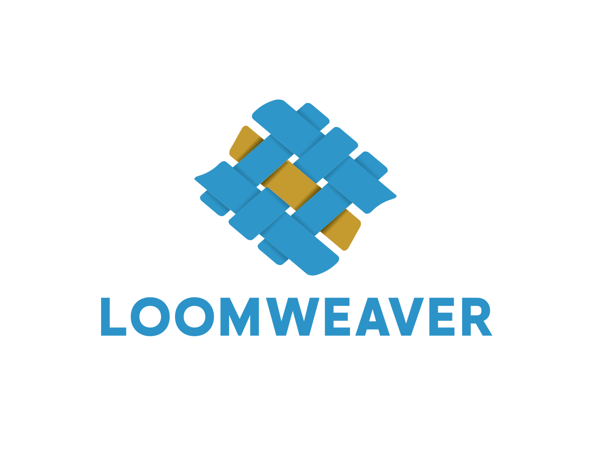
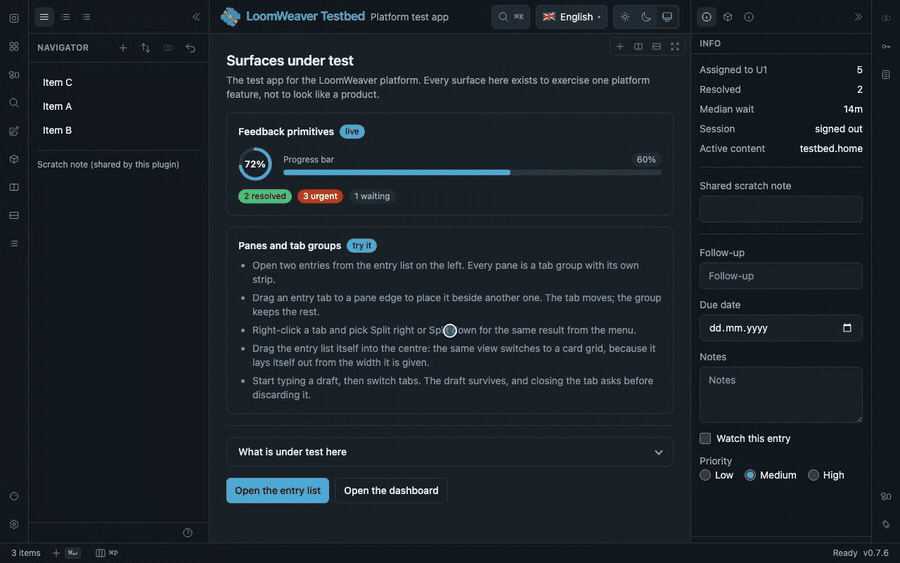
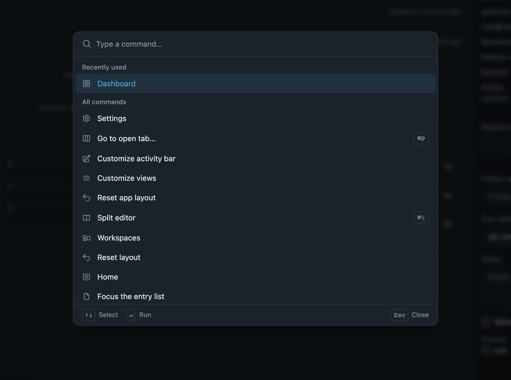

<p align="center">
  
</p>

<p align="center">
  <b>Build the product. Not the workbench.</b><br>
  Panes, tabs, a command palette, theming, i18n and a plugin store, ready on the first day.<br>
  Your domain arrives as a plugin. So does everyone else's.
</p>

<p align="center">
  <a href="https://github.com/yesbert/loomweaver/actions/workflows/build.yml"></a>
  <a href="LICENSE"></a>
  <a href="https://loomweaver.dev"></a>
  <a href="https://demo.loomweaver.dev"></a>
</p>

---



<p align="center"><sub>Twenty-six seconds, no cuts. The rail, the panes, the palette and the status bar are the platform's. Everything inside them comes from plugins, including the theme at the end. <a href="https://loomweaver.dev">Watch it in better quality</a>.</sub></p>

LoomWeaver gives your product its entire workbench UI **without you building any of it**. You write
your domain UI as **plugins ("weavers")** against one small contract, compose them
into a branded **distribution** (mostly one providers array), and ship. The core contains **zero
domain logic**, and even first-party product UI goes through the same plugin contract a third party
would use.

## Quick start

```bash
# 1 · A fresh Angular app (or use the one you have)
ng new my-studio --style=css --ssr=false && cd my-studio

# 2 · Install the platform, then scaffold your product and a first plugin
npm install @loomweaver/shell @loomweaver/plugin-sdk @angular/cdk @jsverse/transloco @ng-icons/heroicons \
  @angular/service-worker@$(node -p "require('@angular/core/package.json').version")
npm install -D tailwindcss @tailwindcss/postcss @tailwindcss/typography
npx @loomweaver/cli distribution --name my-studio --title "My Studio" --out . --force
npx @loomweaver/cli weaver --id notes --command --shortcut 'mod+shift+n' --out src/notes

# 3 · Run it
ng serve
```

That is the whole list. The scaffold also wires your build (the style pipeline, the asset globs that
serve the chrome's own strings, the service worker, and the one production setting the generated
content-security policy requires) and registers the weaver in your composition root, so its icon is
in the activity rail on the first run. It only ever *adds*: anything you had already set is left as
you set it, and it names every file it touched.

[Getting started](docs/getting-started.md) walks through these steps and what they generate.
[Manual setup](docs/manual-setup.md) is the same result wired by hand, including the
**Bootstrap / no-Tailwind path** via the pre-compiled stylesheet.

## Two reasons people pick this up

### If you build with an AI assistant

Every new project means teaching it your structure, your routing and your conventions all over
again. You write another instructions file, and it still invents things. The UI is exactly where it
invents most.

LoomWeaver is the same workbench every time, and it is written down for machines:
[`llms.txt`](llms.txt) as the map, [`llms-full.txt`](llms-full.txt) as the whole contract in a single
fetch, and `@loomweaver/mcp` so your assistant scaffolds with tools instead of guesses.

```json
{
  "mcpServers": {
    "loomweaver": { "command": "npx", "args": ["-y", "@loomweaver/mcp"] }
  }
}
```

Then just ask for it: *"add a weaver called invoices with a command and a settings section"*. The
same generators run three ways, so it does not matter whether a person, a CLI or an assistant
invokes them: `@loomweaver/cli` from any command line, `@loomweaver/devkit` as Nx generators, and
`@loomweaver/mcp` over MCP.

### If you want your users to extend it

You built a good tool. People have ideas, and some of them would build those ideas themselves if
they could. They can't, because there is no way in, and opening one means isolation, permissions, a
store, updates and an API you promise not to break. That is not a feature, that is half a year.

All of it is here. And there is **no privileged host API**: your own product UI goes through the
exact same door a stranger's plugin does, which is the only reason a published contract does not
quietly rot. Your community can do everything you can do.

Every tool with a living ecosystem got there the same way. The plugins made the product, not the
roadmap.

**And the two feed each other.** Somebody who wants to contribute to *your* tool points their own
assistant at your `llms-full.txt` and starts. Your contributor onboarding is a URL.

## Register the action once. It is a button, a shortcut, a palette entry and an agent tool.

```ts
ctx.registerCommand({
  id: 'invoices.export',
  title: 'invoices.export',
  description: 'Export the selected invoices as CSV',
  arguments: [
    { name: 'range', kind: 'choice', choices: ['month', 'quarter', 'year'], required: true },
  ],
  callable: true,
  run: (_context, args) => exportInvoices(String(args?.['range'])),
});
```

The rail item, the keystroke, the context menu and the command palette already point at the same
command. `callable: true` adds one more caller: an agent, through `@loomweaver/ag-ui`. You never keep
a second list of tools beside the first, and the guarantee holds without you writing a line of it:
**an agent reaches what the user could have reached, and nothing more.**

See [Callable commands](docs/reference/callable-commands.md) and
[Agent tools](docs/reference/agent-tools.md).

<p align="center">
  
</p>

## What you would otherwise build twice

- **A real workspace** with tab groups, drag-to-split panes, pop-out windows, named
  workspaces, a command palette (`⌘K`), quick-open (`⌘P`), preview tabs and pinning.
- **Theming from semantic tokens** (plain CSS variables). Use the pre-compiled stylesheet with
  Bootstrap or no framework at all, or bring Tailwind. Precedence is product < plugin < tenant.
- **Auth-aware chrome.** Contributions declare an `access` requirement and the shell hides, disables
  or blocks them reactively. Your product brings the session, from whatever auth you already run.
- **No server in the platform.** Settings, working state and auth are **frontend ports** with local
  defaults. Wire them to your own backend (any stack) or run fully standalone.
- **The rest**: an installable PWA with an update flow, i18n with namespaced composition, WCAG 2.1 AA
  accessibility, cross-window state sync, and save/discard/cancel for editors with unsaved work.

## Three rungs of trust, not one switch

1. **Trusted, in-process** — your own weavers, composed at build time.
2. **Sandboxed iframe** — somebody else's code in its own JS context, opaque origin, no reach into
   your DOM. Write the plugin body in **any framework**.
3. **Installed at runtime** — from your curated catalog, with a consent dialog the user answers and
   updates driven by the catalog version.

All three consume the same `ctx`, behind a **default-deny capability broker** the user can inspect
and revoke. Moving a plugin down a rung is a change of trust, not a rewrite.

## Packages

Seven npm packages, one shared version:

| Package           | What it is                                        |
| ----------------- | ------------------------------------------------- |
| `@loomweaver/plugin-sdk` | the plugin contract (what a weaver imports)       |
| `@loomweaver/shell`      | the neutral host chrome (Angular)                 |
| `@loomweaver/frame-kit`| UI assets for sandboxed (iframe) plugins          |
| `@loomweaver/cli`        | scaffolding from the command line                 |
| `@loomweaver/devkit`     | the same scaffolds as Nx generators               |
| `@loomweaver/mcp`        | the same scaffolds over MCP, for AI assistants    |
| `@loomweaver/ag-ui`      | the adapter that offers the workbench's commands to an agent |

## How it fits together

- **Layer 1 — LoomWeaver (this repo):** plugin registry, extension points, capability broker,
  theming engine, sandbox RPC, plugin loader. Domain-pure, frontend-only.
- **Layer 2 — your weavers:** the product UI, mechanically indistinguishable from third-party
  plugins.
- **A product is a distribution**: a thin composition of the published packages, and it never forks
  the core. See
  [Building a distribution](docs/building-a-distribution.md) and
  [Backend integration](docs/backend-integration.md) for the product hand-off.

Read [Architecture](docs/architecture.md) for the mental model, and [Samples](docs/samples.md) for
copyable recipes: views, commands, dialogs, settings, sync.

System-near local execution a browser cannot do (files, shell, OCR) is the job of **Treadle**, a
small user-installed companion agent that speaks MCP: opt-in, capability-gated, and scoped to the
user's own machine.

## The live demo

> **The [live demo](https://demo.loomweaver.dev) is being rebuilt.** It has moved out of this
> repository into a standalone product that installs the platform from a registry exactly as any
> other consumer would, and it comes back one reviewable slice at a time. Quotes, the dashboard, an
> agent and a sandboxed payment matcher are in; orders and invoices follow. The recording at the top
> is the platform's own testbed, which exercises more of the shell than the demo does today, and
> [Getting started](docs/getting-started.md) gets you the real thing in five minutes.

## Working in this repo

- **This is where LoomWeaver is developed.** `main` is protected and takes no direct pushes; work
  arrives through pull requests that have to pass the checks first. The history before the first
  public commit is not here: the project was developed privately and opened at a fixed state.
- Frontend: Angular + Nx under `platform/`, and this repo is frontend-only. Run the testbed with
  `npm run start:testbed` (from `platform/`; serves HTTPS on `https://127.0.0.1:4200`, binding the
  IPv4 loopback, so an IPv6 `localhost` may not answer). A `prestart:testbed` hook generates a
  self-signed `localhost` certificate into `platform/.certs/` via `openssl` when one is missing;
  trust it once so the browser accepts the page. On macOS:
  `sudo security add-trusted-cert -d -r trustRoot -k /Library/Keychains/System.keychain platform/.certs/aspnet-dev.pem`.
  The dev server runs without a service worker on purpose; to exercise the PWA install and the
  update flow, use `npm run preview:testbed` (production build, served on `https://127.0.0.1:4300`).
- Documentation source: [`docs/`](docs/), the same content published at
  [loomweaver.dev](https://loomweaver.dev). Start at the [docs index](docs/README.md).
- AI-facing map (for integrators and their assistants): [`llms.txt`](llms.txt) +
  [`llms-full.txt`](llms-full.txt), a curated entry point and a single-fetch full brief.

## Contributing

Issues are the main channel: bug reports, questions and proposals are all welcome. Small,
self-contained pull requests are welcome too; for anything larger, please open an issue first so the
design conversation happens before you spend an evening on it.
[`CONTRIBUTING.md`](CONTRIBUTING.md) has the DCO sign-off, the development setup and the code
conventions.

Security reports go to **security@loomweaver.dev**, never to a public issue. See
[`SECURITY.md`](SECURITY.md). Participation is covered by our
[Code of Conduct](CODE_OF_CONDUCT.md).

## Brand

The mark is a woven mat: blue warp threads with gold accent threads woven through (the plugins).
Colors: **blue `#2E96C9`**, **gold `#C59A2F`**. Assets in [`assets/brand/`](assets/brand/).

## License

[Apache License 2.0](LICENSE), see [`NOTICE`](NOTICE).
