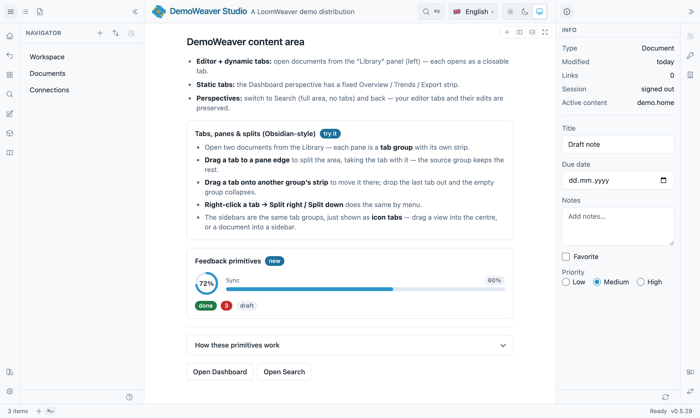

<p align="center">
  
</p>

<p align="center">
  <b>The plugin & UI platform your product runs on — a thin core with zero domain logic.<br>
  The "actual app" is a plugin bundle.</b>
</p>

<p align="center">
  <a href="https://github.com/yesbert/loomweaver/actions/workflows/build.yml"></a>
  <a href="LICENSE"></a>
  <a href="https://loomweaver.dev"></a>
  <a href="https://demo.loomweaver.dev"></a>
</p>

---

This is what a product on LoomWeaver looks like — the icon rail, the sidebars, the tabbed content
area with split panes and the status bar are all the platform's, and everything inside them comes
from plugins. The full documentation lives at **[loomweaver.dev](https://loomweaver.dev)**.



> **The [live demo](https://demo.loomweaver.dev) is being rebuilt.** It has moved out of this
> repository into a standalone product that installs the platform from a registry exactly as any
> other consumer would, and it comes back one reviewable slice at a time. Quotes, the dashboard, an
> agent and a sandboxed payment matcher are in; orders and invoices follow. The screenshot above
> still shows more of the platform than the demo does today, and
> [Getting started](docs/getting-started.md) gets you the real thing in five minutes.

## What is LoomWeaver?

LoomWeaver gives your product the workbench UI of VS Code or Obsidian — panes, tabs, sidebars,
command palette, settings, theming, a plugin store — **without you building any of it**. You write
your domain UI as **plugins ("weavers")** against one small contract, compose them into a branded
**distribution** (mostly one providers array), and ship. The core itself contains **zero domain
logic**; even first-party product UI goes through the same plugin contract a third party would use.

- **Quick start** — a running, branded product in ~5 minutes: [Getting started](docs/getting-started.md)
- **The mental model** — platform / weaver / distribution: [Architecture](docs/architecture.md)
- **Copyable recipes** — views, commands, dialogs, settings, sync: [Samples](docs/samples.md)

## Quick start

```bash
# 1 · A fresh Angular app (or use the one you have)
ng new my-studio --style=css --ssr=false && cd my-studio

# 2 · Install the platform, then scaffold your product and a first plugin
npm install @loomweaver/shell @loomweaver/plugin-sdk @angular/cdk @jsverse/transloco @ng-icons/heroicons \
  @angular/service-worker@$(node -p "require('@angular/core/package.json').version")
npm install -D tailwindcss @tailwindcss/postcss @tailwindcss/typography
npx @loomweaver/cli distribution --name my-studio --title "My Studio" --out . --force
npx @loomweaver/cli weaver --id notes --command --shortcut 'mod+shift+n' --out src/notes

# 3 · Run it
ng serve
```

[Getting started](docs/getting-started.md) walks through these steps and what they generate;
[Manual setup](docs/manual-setup.md) is the same result wired by hand — including the
**Bootstrap / no-Tailwind path** via the pre-compiled stylesheet.

> The `@loomweaver/*` packages are not on the public npm registry yet — the first public release publishes
> them. Until then they come from LoomWeaver's own package feed (configure the `@loomweaver` scope in an
> `.npmrc`); everything else is identical.

## What you get out of the box

- **A real workspace** — tab groups with drag-to-split panes (Obsidian-style), pop-out windows,
  named workspaces, a command palette (`⌘K`) and quick-open (`⌘P`), preview tabs and pinning.
- **A real plugin system** — one `ctx` contract on three trust rungs: trusted in-process, sandboxed
  iframe (write the plugin body in **any framework**), and community plugins users install at
  runtime from a built-in store. All of it sits behind a **default-deny capability broker** the user
  can inspect and revoke.
- **Bring your own CSS framework** — the whole UI is driven by semantic design tokens (plain CSS
  variables). Use the pre-compiled stylesheet with Bootstrap or no framework at all, or bring
  Tailwind; theming is a token map with product < plugin < tenant precedence.
- **Auth-aware chrome** — contributions declare an `access` requirement; the shell hides, disables
  or blocks them reactively. Your product brings the session, from whatever auth you already run.
- **No server in the platform** — settings, working state and auth are **frontend ports** with local
  defaults; wire them to your own backend (any stack) or run fully standalone.
- **The rest you'd otherwise build twice** — installable PWA with an update flow, i18n with
  namespaced composition, WCAG 2.1 AA accessibility, cross-window state sync, and dirty/close
  protection for editors with unsaved work.

## Packages

Seven npm packages, one shared version:

| Package           | What it is                                        |
| ----------------- | ------------------------------------------------- |
| `@loomweaver/plugin-sdk` | the plugin contract (what a weaver imports)       |
| `@loomweaver/shell`      | the neutral host chrome (Angular)                 |
| `@loomweaver/frame-kit`| UI assets for sandboxed (iframe) plugins          |
| `@loomweaver/cli`        | scaffolding from the command line                 |
| `@loomweaver/devkit`     | the same scaffolds as Nx generators               |
| `@loomweaver/mcp`        | the same scaffolds over MCP, for AI assistants    |
| `@loomweaver/ag-ui`      | the adapter that offers the workbench's commands to an agent |

## How it fits together

- **Layer 1 — LoomWeaver (this repo):** plugin registry, extension points, capability broker,
  theming engine, sandbox RPC, plugin loader. Domain-pure, frontend-only.
- **Layer 2 — your weavers:** the product UI, mechanically indistinguishable from third-party
  plugins.
- **A product is a distribution** (like VSCodium is of VS Code): a thin composition of the published
  packages — it never forks the core. See [Building a distribution](docs/building-a-distribution.md)
  and [Backend integration](docs/backend-integration.md) for the product hand-off.

System-near local execution a browser cannot do (files, shell, OCR) is the job of **Treadle**, a
small user-installed companion agent that speaks MCP — opt-in, capability-gated, and scoped to the
user's own machine.

## Working in this repo

- **This is where LoomWeaver is developed.** `main` is protected and takes no direct pushes; work
  arrives through pull requests that have to pass the checks first. The history before the first
  public commit is not here — the project was developed privately and opened at a fixed state.
- Frontend: Angular + Nx under `platform/` — this repo is frontend-only. Run the testbed with
  `npm run start:testbed` (from `platform/`; serves HTTPS on `https://127.0.0.1:4200` — it binds the
  IPv4 loopback, so an IPv6 `localhost` may not answer). A `prestart:testbed` hook generates a
  self-signed `localhost` certificate into `platform/.certs/` via `openssl` when one is missing;
  trust it once so the browser accepts the page — on macOS
  `sudo security add-trusted-cert -d -r trustRoot -k /Library/Keychains/System.keychain platform/.certs/aspnet-dev.pem`.
  The dev server runs without a service worker on purpose; to exercise the PWA install and the
  update flow, use `npm run preview:testbed` (production build, served on `https://127.0.0.1:4300`).
- Documentation source: [`docs/`](docs/) — the same content that is published at
  [loomweaver.dev](https://loomweaver.dev). Start at the [docs index](docs/README.md).
- AI-facing map (for integrators & their assistants): [`llms.txt`](llms.txt) +
  [`llms-full.txt`](llms-full.txt) — a curated entry point and a single-fetch full brief.

## Contributing

Issues are the main channel — bug reports, questions and proposals are all welcome. Small,
self-contained pull requests are welcome too; for anything larger, please open an issue first so the
design conversation happens before you spend an evening on it.
[`CONTRIBUTING.md`](CONTRIBUTING.md) has the DCO sign-off, the development setup and the code
conventions.

Security reports go to **security@loomweaver.dev**, never to a public issue — see
[`SECURITY.md`](SECURITY.md). Participation is covered by our
[Code of Conduct](CODE_OF_CONDUCT.md).

## Brand

The mark is a woven mat — blue warp threads with gold accent threads woven through (the plugins).
Colors: **blue `#2E96C9`**, **gold `#C59A2F`**. Assets in [`assets/brand/`](assets/brand/).

## License

[Apache License 2.0](LICENSE) — see [`NOTICE`](NOTICE).
